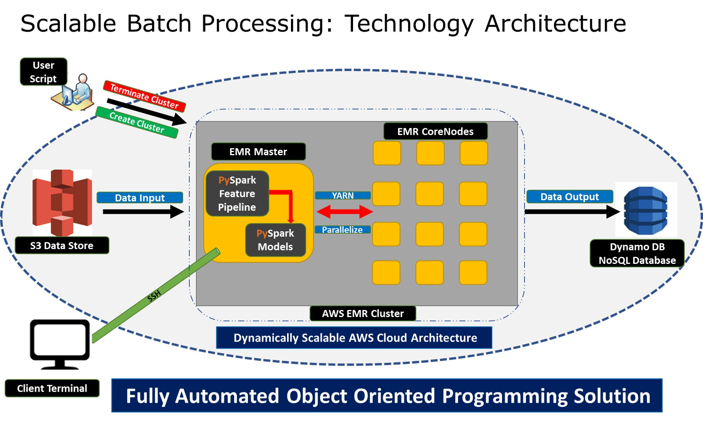

#  Gigabyte scale Amazon Product Reviews Sentiment Analysis Challenge: A scalable pySPARK NLP Machine Learning Pipeline hosted on AWS EMR Cloud
This project implements the Amazon Web Services (AWS) cloud deployment of big data train/test pipeline of gigabyte scale NLP machine learning algorithm to analyze the sentiment of Amazon product reviews using AWS elastic map reduce architecture. The object oriented code was implemented using pySpark machine learning and pySpark SQL libraries. Prior to building the big data solution, I did extensive data cleaning, feature engineering, data visualization, and built prototype models to investigate the underlying data using sci-kit learn and seaborn. The details of the prototype model can be found in the /prototype/prototype.ipynb notebook.

Data Source:
Amazon Review Data (2018) was sourced from deepyeti.ucsd.edu/jianmo/amazon/index.html

The per category review data was unzipped and stored in the Amazon S3 bucket.

Feature Data Pipeline:

Three class labels were generated for the positive, negative, and neutral classes. For the two class labels, positive and neutral/negative labels were used.

The feature data was processed using the pySpark feature pipeline shown in the illustration below:

The following AWS architecture was launched to run the pySpark feature pipeline and machine learning models: 

A total of 12 cluster nodes were used to deploy the above pipeline. The big data model yielded better performance compared to the baseline prototype model.

Notes:

The instructions to launch the AWS EMR cluster and execute the code are under /scripts/AWS_EMR_Configure_Instructions.

The source files are under /src/

The prototype model Jupyter Notebook can be found in the folder /prototype/
